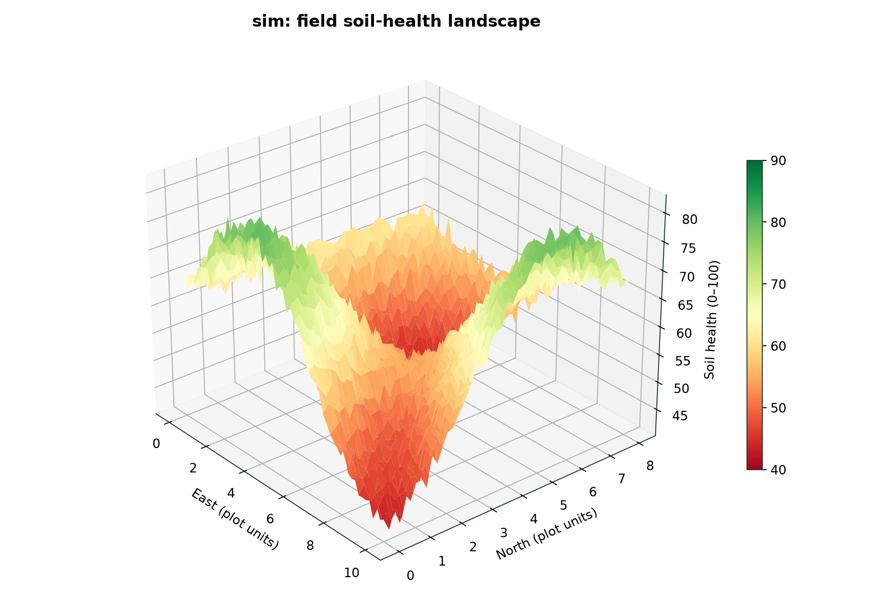
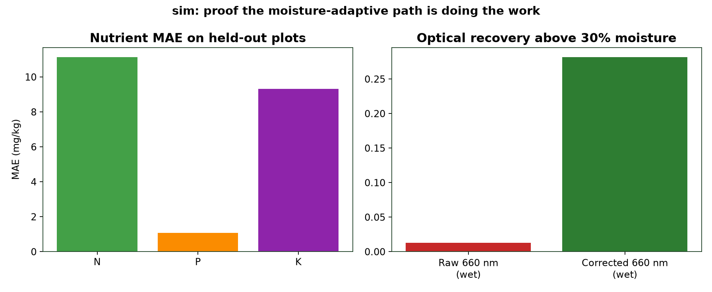
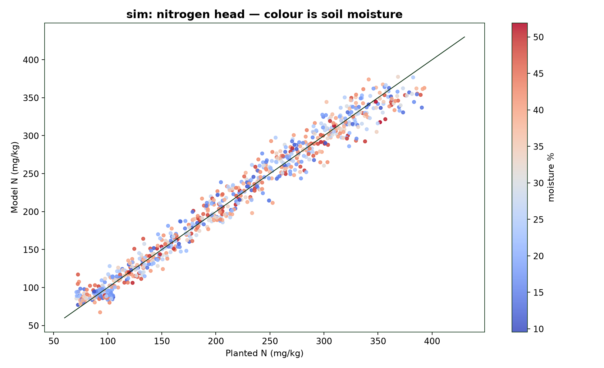
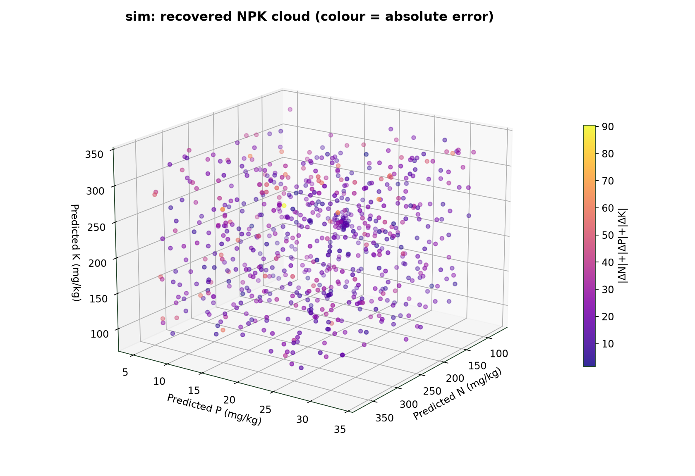
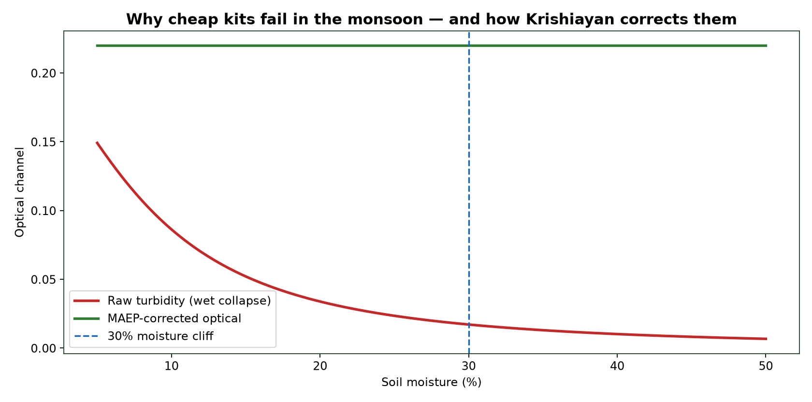
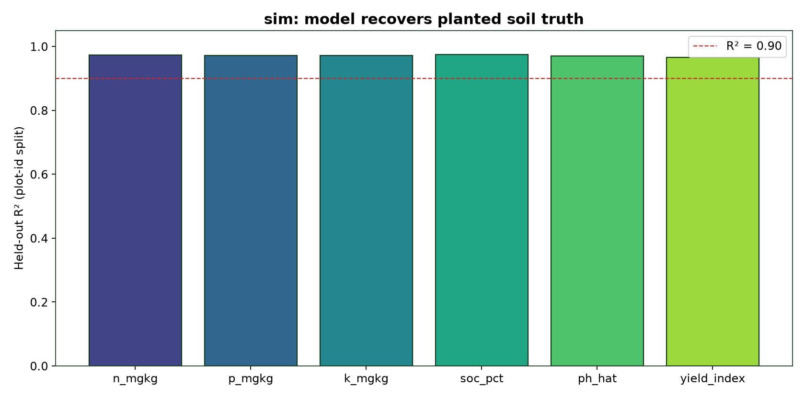
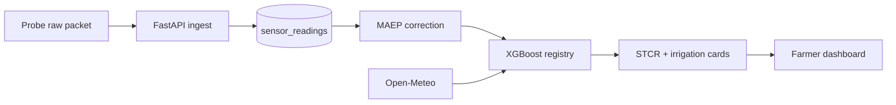

<div align="center">

# **Krishiayan**

</div>
<div align="center">

**The soil guide for the Indian farmer** — raw probe packets, moisture-adaptive optical correction, conformal ML, and a fertilizer *what / how much / when* card. Not a 14-day lab wait.

[](https://python.org)
[](https://fastapi.tiangolo.com)
[](https://xgboost.ai)
[](https://nextjs.org)
[](LICENSE)
[](https://github.com/knokvik/krishiayan)

**Team:** Niraj Rajendra Naphade · Yash Rajesh Kalagate · MIT Academy of Engineering, Pune
**Domain:** Agri-Tech and Water Resilience

### Field soil-health landscape

<p align="center">
  
</p>


---

## **Abstract**

> **Question:** If a handheld probe already feels moisture, EC, temperature, EIS and a 660 nm / NIR extract in the root zone — why does the farmer still guess the bag of urea?

Krishiayan is the **software brain** of a compact in-situ soil probe. Hardware sends **raw ADC, optical, EIS and colorimetric readings**. This repository turns them into eight soil numbers with intervals, joins live weather, and speaks in farmer language:

<p align="center">
  
</p>

| Output | What the farmer sees | What the model actually did |
|---|---|---|
| **Fertilizer card** | “Apply 25 kg urea per acre in the next 3 days” | STCR dose from predicted N/P/K, split by crop stage, **blocked if 48 h rain ≥ 20 mm** |
| **Irrigation card** | “Irrigate within 48 hours” / “Wait, rain is coming” | Root-zone moisture vs crop band + ET0 + forecast |
| **Crop condition** | Good / Watch / Stress, with the driver named | XGBoost stress head (water, N, P, K, salt, heat, waterlogging) |
| **Tool insight** | Battery weeks, dirty tip, calibration age | Packet SNR + voltage trend |

**Why moisture correction exists:** 2-propanol + NaCl turbidity (and cheap optical kits) collapse above ~30% soil moisture — recovery falls to ~33%. Krishiayan measures moisture in situ and restores the optical channel **before** ML:

```
corrected = raw_turbidity × [1 + 0.035 m + 0.012 m²] × density_factor
```

On the bundled simulator, wet-soil mean raw 660 nm is **0.013**; after MAEP it is **0.28**. SOC MAE stays ~0.03 on both wet and dry held-out plots.

---

## **Proof of Results — Demo Pipeline (Simulated Probe)**

The graphs below are produced by running the full pipeline on a **bundled simulated probe feed** (2,400 planted Maharashtra plots, plot-id grouped split). They demonstrate that the platform *recovers what was planted*. Every chart is labelled `sim:`.

### Nitrogen head, coloured by moisture

<p align="center">
  
</p>

### Recovered NPK cloud (colour = absolute error)

<p align="center">
  
</p>

### Wet-soil optical collapse vs MAEP correction

<p align="center">
  
</p>

<p align="center">
  
</p>

| Finding | Result (`sim:`, plot-id split, n_test = 480) |
|---|---|
| N (mg/kg) | MAE **11.13**, R² **0.973**, 90% conformal coverage 0.88 |
| P (mg/kg) | MAE **1.08**, R² **0.972**, coverage 0.91 |
| K (mg/kg) | MAE **9.31**, R² **0.972**, coverage 0.93 |
| SOC (%) | MAE **0.029**, R² **0.974** |
| pH | MAE **0.097**, R² **0.970** |
| Yield index | MAE **0.015**, R² **0.966** |
| Crop stress (8 classes) | Accuracy **0.919** |
| Wet optical 660 nm | raw **0.013** → corrected **0.282** |
| Design target (not claimed as lab) | ±2.8% NPK after a local wet-chem campaign |

Full numbers: [`models/artifacts/metrics.json`](models/artifacts/metrics.json) · [`models/artifacts/eval.md`](models/artifacts/eval.md).

---

## **Eight soil intelligence metrics**

| Metric | Farmer meaning | Unit |
|---|---|---|
| Nitrogen | Growth fuel. Too little = yellow/stunted. | mg/kg |
| Phosphorus | Root builder / germination. | mg/kg |
| Potassium | Disease / drought shield. | mg/kg |
| pH | Most Indian crops 6.0–7.5. Wrong pH locks nutrients. | pH |
| EC | High = salt damage. | dS/m |
| Moisture | Irrigate today or not. | % v/v |
| Temperature | Germination and root activity at depth. | °C |
| SOC | Humus bank, water holding, long-term fertility. | % |

---

## **Architecture**

```
Krishiayan probe (ESP32, depth rings, 660 nm + NIR, EIS, colorimetric)
        │  raw JSON  (simple fields or layered packet)
        ▼
┌──────────────────┐     ┌─────────────────────────────┐
│ Ingest API       │────►│ Persist RAW first            │
│ HTTP / batch     │     │ Anomaly score                │
└──────────────────┘     └─────────────┬───────────────┘
                                       ▼
                         ┌─────────────────────────────┐
                         │ Calibrate ADC → physical    │
                         │ MAEP moisture correction    │
                         │ Feature builder             │
                         └─────────────┬───────────────┘
         Open-Meteo ───────────────────┤
         Crop calendar / STCR ─────────┤
                                       ▼
                         ┌─────────────────────────────┐
                         │ XGBoost heads + 90% CI      │
                         │ N P K SOC pH yield stress   │
                         └─────────────┬───────────────┘
                                       ▼
                         ┌─────────────────────────────┐
                         │ Agronomy engine             │
                         │ what / how much / when      │
                         │ rain-aware do-not           │
                         └─────────────┬───────────────┘
                                       ▼
              Next.js farmer UI  ·  Swagger /docs  ·  tool health
```



**Backend:** FastAPI, SQLAlchemy 2, SQLite by default / TimescaleDB in Docker, Redis + Celery optional, JWT auth, Pydantic v2.
**ML:** `ml/train.py` → `models/artifacts/bundle.joblib` (XGBoost + conformal q90).
**Frontend:** Next.js 14 App Router, Tailwind, Recharts, mobile-first.

---

## **Reproduce**

```bash
# Python ≥ 3.11
python -m venv .venv && source .venv/bin/activate
pip install -e ".[dev]"

# 1. Train heads on the planted simulator (CPU, ~30 s)
python ml/train.py

# 2. Evaluation report
python ml/evaluate.py

# 3. Coloured 3D README figures
python scripts/make_figures.py

# 4. API
uvicorn krishiayan.api.main:app --reload --port 8000
# Swagger: http://127.0.0.1:8000/docs

# 5. Seed a demo farmer (farmer@example.com / soilguide)
python scripts/seed.py

# 6. Simulate a low-N Pune wheat packet onto ingest
krishiayan simulate --scenario pune-wheat-n-deficient --push http://127.0.0.1:8000/v1/ingest/scan

# 7. Farmer UI
cd frontend && npm install && npm run dev
# http://localhost:3000  →  “Run Pune wheat demo”

# Tests
pytest
```

### Docker (TimescaleDB + Redis + API + worker + UI)

```bash
cp .env.example .env
docker compose up --build
```

### Environment

| Variable | Default | Purpose |
|---|---|---|
| `DATABASE_URL` | `sqlite:///./krishiayan.db` | Use `postgresql+psycopg://…` with compose |
| `SECRET_KEY` | dev string | JWT signing |
| `REDIS_URL` / `CELERY_BROKER_URL` | localhost:6379 | Optional cache + weather jobs |
| `OPENWEATHER_API_KEY` | empty | Unused unless you switch `WEATHER_PROVIDER` |
| `WEATHER_PROVIDER` | `open_meteo` | No key required |
| `CORS_ORIGINS` | `http://localhost:3000` | Farmer UI |
| `MODEL_DIR` | `models/artifacts` | Joblib registry |

---

## **Probe packet (hardware contract)**

`POST /v1/ingest/scan` accepts **both** the simple hardware JSON and the full layered Krishiayan packet.

```json
{
  "device_id": "KA-PROBE-0001",
  "field_id": "…",
  "soil_moisture": 22.5,
  "soil_temperature": 29.1,
  "electrical_conductivity": 0.8,
  "ph": 6.7,
  "soc_proxy": 0.9,
  "battery_level": 3.9
}
```

Layered packets add `layers[]` with `moisture_raw`, `eis_real`, `optical_660`, `optical_nir`, `colorimetric_rgb`, `extraction.turbidity_660`. Schema is versioned (`schema_version: "1.0.0"`). Raw JSON is stored **before** any ML.

Authenticated farmer loop: `POST /v1/simulate?scenario=pune-wheat-n-deficient&field_id=…` then `GET /v1/fields/{id}/latest`.

---

## **Roadmap**

| Track | Scope | Status |
|---|---|---|
| **A** (this repo) | Ingest, MAEP correction, XGBoost heads, STCR cards, Open-Meteo, dashboard, sim proof | **Complete** |
| **B** | Bluetooth phone bridge, TFLite on ESP32, Soil Health Card export, FPO rental mode | Registered, not claimed |
| **C** | Maharashtra wet-chem campaign (N ≥ 200 paired samples) before any field ±2.8% claim | Not started |

Full note: [docs/roadmap.md](docs/roadmap.md).

---

## **Deliberate Non-Claims**

- **No lab certificate.** NPK/SOC here are calibrated proxies. The ±2.8% pitch number is a *design target*, not a measured field result.
- **No simulated data presented as real** — labelled `sim:` on the dashboard, in metrics, and in every README figure.
- **No pesticide diagnosis** from soil packets. High humidity is a *scout* hint, not a disease ID.
- **No Teralytic-class depth physics faked in software.** Depth rings are a hardware fact; this repo consumes whatever layers the probe sends.

---

## **Contribute**

1. One feature per commit, conventional messages (`feat:`, `fix:`, `docs:`, `test:`).
2. `pytest` green before push. Do not force-push `main`.
3. Farmer-visible strings go in `src/krishiayan/agronomy/recommend.py` COPY tables (en / hi / mr) — not hardcoded in the UI.
4. Retrain with `python ml/train.py` and commit `models/artifacts/metrics.json` when heads change.
5. Open a PR against `main` with the plot or metric that proves the change.

---

## **References**

| Resource | Location |
|---|---|
| Held-out metrics | [models/artifacts/metrics.json](models/artifacts/metrics.json) |
| Eval write-up | [models/artifacts/eval.md](models/artifacts/eval.md) |
| 3D figures | [docs/figures/](docs/figures/) |
| Crop / STCR specs | [src/krishiayan/services/crops.py](src/krishiayan/services/crops.py) |
| Fertilizer prices | [data/icar/fertilizer_prices.json](data/icar/fertilizer_prices.json) |
| Roadmap | [docs/roadmap.md](docs/roadmap.md) |
| API | `/docs` on the running server |

---

## **krishiayan**

<p align="center">
  <a href="https://python.org"></a>
  <a href="https://fastapi.tiangolo.com"></a>
  <a href="https://xgboost.ai"></a>
  <a href="https://nextjs.org"></a>
  <a href="https://github.com/knokvik/krishiayan"></a>
  <br>
  <a href="https://opensource.org/licenses/MIT"></a>
  <a href="#"></a>
  <a href="#"></a>
</p>

<p align="center">
  <sub>Built with Python, FastAPI, SQLAlchemy, XGBoost, scikit-learn, Next.js, Tailwind, Recharts, and Matplotlib.</sub>
</p>
